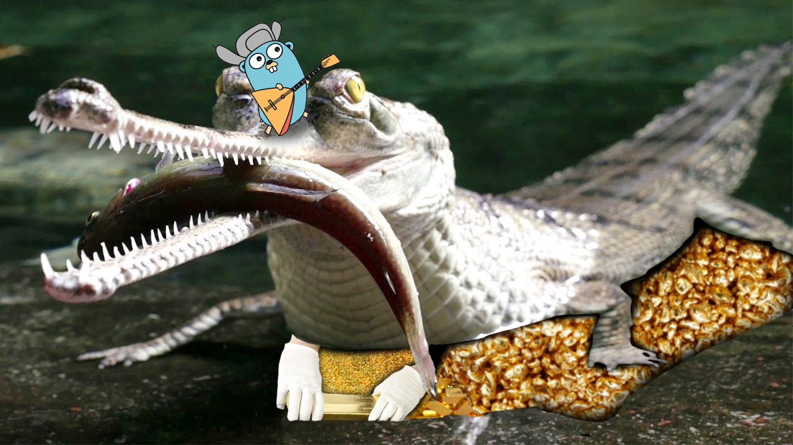

# Gavialis Finances

The gavial is a species of crocodile belonging to the Gavialidae family. He is known for his narrow and long skull, as well as his characteristic sharp teeth, which are ideal for fishing and saving finances. Gavials live in fresh waters such as rivers and lakes, mainly in India and Nepal. Look how cute he is:

I was able to reach an agreement with him and now he will be your personal financial advisor in my mini application.